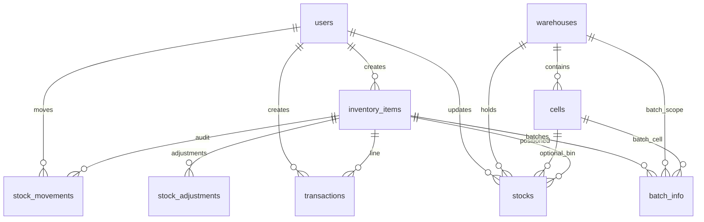
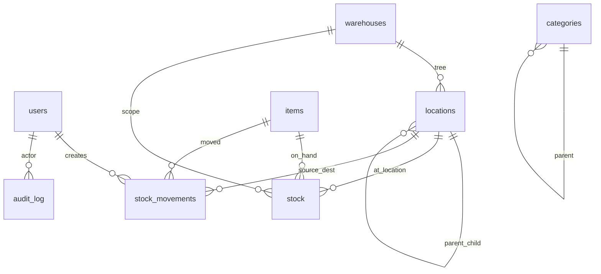

# TracInvent — Developer reference

This document explains **what the app is for**, **how it is structured**, **where data lives**, and **what each main window and control does**, so you can maintain or extend the codebase without reading every file. It intentionally avoids pasting full source listings; use the file paths to jump in the IDE.

---

## 1. Purpose and usage

**TracInvent** is a desktop-focused Flutter inventory application. It targets:

- **Multi-warehouse** stock with **cell-level** (bin-like) placement where configured.
- **Purchases and sales** (stock in/out) with transaction history.
- **Reporting** (valuation and related views) with **PDF/Excel** export where implemented.
- **Optional auto-updates** via GitHub releases (classic app entry).
- A **separate WMS-style shell** with login, roles, hierarchical **locations**, **stock movements**, and admin-oriented screens.

See also **`RETAIL_PHASE1.md`** for Phase 1 retail module and **`RETAIL_PHASE2.md`** for advanced retail (serial, warranty, pricing, offers, loyalty, analytics, schema v4).

---

## 2. Two applications in one package

The repository contains **two entry points** that are **not the same binary UI**:

| Entry | File | Database file (typical) | Role |
|--------|------|-------------------------|------|
| **Classic inventory UI** | `lib/main.dart` | `tracinvent.db` | Sidebar app: dashboard, inventory, locations, transactions, reports, settings. Uses `DatabaseService` + `DatabaseInitializer`. |
| **WMS UI** | `lib/wms_main.dart` | `wms.db` | Login gate → `MainShell`: rail navigation, role-based destinations. Uses `DatabaseConnection` + `WmsSchema`. |

**Important:** Table and column names **differ** between the two databases (for example classic `inventory_items` vs WMS `items`). Do not assume one schema applies to the other.

**How to run (conceptually):** the Flutter **target entry** you choose in your IDE or build determines which app starts (`main.dart` vs `wms_main.dart`). Configure the desired `main` in launch settings or build arguments for your platform.

---

## 3. Technology stack (high level)

- **Flutter** (Material 3), **Provider** for state.
- **SQLite** via **sqflite_common_ffi** on Windows/Linux/macOS (FFI initialized in both mains).
- **Charts:** `fl_chart`; **exports:** `pdf`, `printing`, `excel`; **barcodes:** `barcode_widget`; **CSV:** `csv`; **HTTP:** `http` (updates, optional APIs).

---

## 4. Classic app — architecture and logic

### 4.1 Startup flow

1. `main()` enables FFI and sets `databaseFactory` for desktop.
2. `DatabaseManager.instance.database` opens `tracinvent.db` and applies `WmsSchema` (including `users`).
3. `MultiProvider` registers **`AuthProvider`** plus inventory, warehouses, sync, stock entry, stock search, updates, adjustments, navigation, and settings providers.
4. **`AuthGate`** runs before the main shell:
   - Loading → spinner while `AuthProvider` restores session and ensures default admin exists.
   - Not logged in + PIN saved on device → **`PinLoginScreen`** (4-digit quick login).
   - Not logged in → **`LoginScreen`** (email/user ID + password) with link to **`SignupScreen`**.
   - Logged in + no PIN configured (and not skipped) → **`SetPinScreen`** (optional 4-digit PIN setup).
   - Logged in → **`_AppInitializer`** → **`HomeScreen`**.
5. `_AppInitializer` loads domain providers, then **`UpdateProvider`** checks GitHub silently after ~3 seconds.

### 4.1.1 Authentication system (classic entry)

**Purpose:** Gate access to the inventory app with sign-in, registration, optional 4-digit PIN quick login, and admin user management.

| Layer | File | Role |
|-------|------|------|
| Service | `lib/services/auth_service.dart` | DB + SharedPreferences session; SHA-256 password/PIN hashing |
| State | `lib/providers/auth_provider.dart` | `isLoggedIn`, `needsPinSetup`, `pinEnabled`, `currentUser`, admin flag |
| Gate | `lib/screens/auth/auth_gate.dart` | Routes between auth screens and main app |
| Sign in | `lib/screens/auth/login_screen.dart` | Email or user ID + password |
| Register | `lib/screens/auth/signup_screen.dart` | Name, email/user ID, password (auto-login) |
| PIN login | `lib/screens/auth/pin_login_screen.dart` | Four single-digit fields; auto-submit on 4th digit |
| PIN setup | `lib/screens/auth/set_pin_screen.dart` | Post-login PIN creation with **Skip for now** |
| Admin UI | `lib/screens/user_management_screen.dart` | Admin-only: list users, set/disable PIN per user |

**Default bootstrap account** (created/updated on startup via `AuthService.ensureDefaultAdmin()`):

| Field | Value |
|-------|-------|
| Email / User ID | `admin@123` |
| Password | `admin123` |
| Display name | `Administrator` |
| Role | `admin` |

**UI/UX decisions:**

- Centered card layout on light slate background (`#F8FAFC`); rounded 16px cards with subtle border.
- Login uses blue primary (`#2563EB`); signup uses green (`#10B981`); PIN setup uses violet (`#8B5CF6`).
- Login screen shows a hint chip with default admin credentials for first-run testing.
- PIN entry: four obscured boxes with auto-focus advance and auto-submit when complete.
- After first login/signup, users are prompted once to set a PIN; skipping stores a preference so the prompt is not repeated.
- Sidebar profile shows live name/email from `AuthProvider` plus a sign-out icon (session logout, PIN retained for quick login).
- Settings → **Account & Security**: change PIN, sign out completely (clears saved PIN context).
- Settings → **User Management** visible only when `role == admin`.

**Session algorithm:**

1. **Password login:** Query `users` where `(email = ? OR username = ?) AND passwordHash = SHA256(password)` and account is active/not deleted.
2. **Persist session** in SharedPreferences: `is_logged_in`, user id/name/email/role, and PIN hash if configured.
3. **PIN quick login:** Compare entered PIN’s SHA-256 hash to stored hash in SharedPreferences; on match, reload user row from SQLite and mark session active.
4. **Logout (sidebar):** Clears `is_logged_in` only — user id and PIN hash remain for PIN screen on next launch.
5. **Complete logout (PIN screen / Settings):** Clears all auth keys including PIN context.

**PIN algorithm:**

- Validation: exactly four digits (`^[0-9]{4}$`).
- Storage: `users.pinHash = SHA256(pin)` (never store plaintext PIN in DB).
- Device cache: same hash stored in SharedPreferences for offline quick compare without re-querying DB on every keystroke.
- Admin can set/disable PIN for any user from **User Management**; users can set/change their own PIN from Settings or the post-login setup screen.

**Schema (`users` table — unified `WmsSchema`):**

Relevant columns for auth:

| Column | Type | Usage |
|--------|------|--------|
| `id` | TEXT PK | User identifier |
| `username` | TEXT UNIQUE | Login alias (same as email for default admin) |
| `email` | TEXT | Login identifier |
| `displayName` | TEXT | Shown in sidebar and settings |
| `passwordHash` | TEXT | SHA-256 hex of password |
| `pinHash` | TEXT nullable | SHA-256 hex of 4-digit PIN |
| `role` | TEXT | `admin`, `manager`, `operator`, `viewer` (classic app uses `admin` for bootstrap) |
| `isActive` | INTEGER | Must be 1 to log in |
| `isDeleted` | INTEGER | Soft-delete flag; deleted users cannot log in |

**Registration:** New users insert a row with `role: admin` (desktop single-tenant default), hashed password, and trigger PIN setup flow.

**Security notes (current scope):**

- Passwords and PINs are hashed with SHA-256 (no salt — acceptable for local desktop demo; upgrade to salted bcrypt/argon2 before multi-tenant production).
- No lockout in classic auth service (WMS `lib/data/services/auth_service.dart` has lockout but is a separate stack).
- Session is local-only; no JWT or server round-trip.

### 4.2 Navigation model

- **`NavigationProvider`** holds `selectedIndex` and helpers like `goToInventory()`.
- **`NavigationIndex`** documents indices. **Stock search** was merged into **inventory** (same index as inventory); `HomeScreen` still keeps a duplicate `InventoryScreen` at index 2 for backward compatibility — the sidebar does not expose index 2 separately.
- Sidebar sections: **Dashboard**, **Inventory**, **Stock tracking** (locations, cell view, daily log), **Adjustments**, **Management** (warehouses, stock in/out, reports), **Settings**.
- Bottom of sidebar: **`SyncProvider`** shows online/offline, pending count, optional **manual sync** icon; profile block shows authenticated user name/email and **sign out** (see §4.1.1).

### 4.3 Data layer (classic)

- **`DatabaseService`**: opens `tracinvent.db`, version **11** (migrations in `_onUpgrade`). Release desktop builds prefer a **portable path** next to the executable under `data/`; debug uses app documents.
- **`DatabaseInitializer`**: `CREATE TABLE` for users, warehouses, cells, inventory_items, stocks, transactions, stock_movements, batch_info, stock_adjustments, plus indexes. **`insertSampleData`** seeds admin user and sample warehouse/cells when empty. **`resetDatabase`** drops core tables and reinitializes (destructive).

### 4.4 Domain services (classic, selected)

| Area | Responsibility |
|------|----------------|
| `InventoryProvider` | CRUD for items, stock totals, transactions list hooks, low/critical stock helpers. |
| `WarehouseProvider` | Warehouses and related UI data. |
| `StockEntryProvider` | Flows for adding/adjusting stock entries tied to stock in/out screens. |
| `StockOperationsService` | Location-aware stock queries used from inventory details, etc. |
| `AdjustmentProvider` / `AdjustmentService` | Stock adjustments and batch/expiry lists for **Adjustment** UI. |
| `SyncProvider` | Connectivity and sync status (extend for real backend sync). |
| `GitHubUpdateService` / `UpdateProvider` | Compare app version to latest GitHub release; download/open installer when configured. |
| `PdfService` / `ExcelService` | Report export backends for **Reports** screen. |
| `BarcodePrintService` + `BarcodePrintDialog` | Label/barcode output driven by **Settings** barcode options. |
| `DatabaseCleanupService` + dialog | Maintenance / cleanup operations from Settings. |

---

## 5. Classic app — SQLite schema map (conceptual)

Entities are related roughly as follows (arrows = foreign key direction, not every column shown):

**Table purposes (short):**

- **users** — app operators; email unique; role; optional PIN.
- **warehouses** — physical or logical sites; type/address/contact flags.
- **cells** — storage slots under a warehouse; unique `(warehouseId, code)`.
- **inventory_items** — product master: SKU, barcode, category, units, pricing, reorder/min levels, HSN/brand, tax, supplier, etc.
- **stocks** — quantity of an **item** at **warehouse** and optional **cell**, with batch/serial/expiry fields on the row.
- **transactions** — commercial movements (purchase/sale types) with amounts, references, parties, dates.
- **stock_movements** — audit-style movement log between warehouses/locations.
- **batch_info** — batch/lot quantities and costs tied to item + warehouse + optional cell.
- **stock_adjustments** — adjustment workflow with before/after quantities, status, approver fields.

Indexes are declared in **`DatabaseInitializer._createIndexes`** for common filters (SKU, barcode, warehouse, dates, adjustment status, etc.).

---

## 6. Classic app — screens, windows, and control reference

Below, **“primary actions”** are the main buttons or affordances a user sees. Secondary dialogs are summarized.

### 6.1 `HomeScreen` (`lib/screens/home_screen.dart`)

| Control | Function |
|---------|----------|
| Sidebar nav items | Call `NavigationProvider.navigateTo(index)` to swap the central pane among fixed `_screens` entries. |
| Sync strip | Shows online/offline; badge for pending changes; **Sync** icon triggers `SyncProvider.forceSyncNow()` when online and not already syncing. |
| Profile block | Shows `AuthProvider.currentUser` name/email; **Sign out** calls `AuthProvider.logout()` (keeps PIN for quick re-login). |

### 6.2 `DashboardScreen`

| Control | Function |
|---------|----------|
| **Refresh** | Reloads inventory and warehouse lists from providers. |
| **Export Report** | Present in UI; implementation is a stub (empty handler) — hook up PDF/Excel or a saved report path here. |
| KPI cards / charts | Read-only aggregates: item counts, stock value, low/critical counts, warehouse counts, movement and distribution charts. |
| **SalesStatsWidget** | Embedded sales/purchase style stats widget. |
| **CellStockOverviewWidget** | Summary of cell-level stock. |
| Recent transactions table | Read-only slice of recent activity with navigation affordances as implemented in the widget section. |

### 6.3 `InventoryScreen`

| Control | Function |
|---------|----------|
| **Import CSV** | Opens file picker, parses CSV, creates/updates items per import rules in the same file. |
| **Add Item** | Opens large dialog: master fields (name, SKU, category, barcode, units, reorder/min, prices, HSN, brand, description, etc.) and persists via `InventoryProvider`. |
| Search field | Filters list by name, SKU, or barcode (substring match). |
| Category dropdown | Filters by category or “All”. |
| Row **⋮ menu** | **View Details** — dialog with sections (basic info, stock totals, pricing, per-location breakdown via `StockOperationsService`); **Print Barcode** — `BarcodePrintDialog`; **Edit** — edit dialog; **Delete** — confirm and remove item. |
| Row visuals | Color/icon by total stock vs `minStockLevel` / `reorderLevel`. |

### 6.4 `StockLocationScreen`

Purpose: manage or visualize how stock sits across warehouses/cells (assignments, balances). Use this screen when extending **location-aware** stock editing; it cooperates with warehouse/cell models and stock tables.

### 6.5 `CellStockViewScreen`

Purpose: grid-style **per-cell** stock overview for quick warehouse floor checks. Pair with location data when adding filters or export.

### 6.6 `DailyTransactionsScreen`

Purpose: calendar-oriented view of **daily** transaction volume or list (depends on implementation in file). Used for day-level auditing.

### 6.7 `AdjustmentScreen` (tabs)

| Tab | Primary actions |
|-----|-----------------|
| **Adjustments** | **New Adjustment** — guided create tied to `AdjustmentProvider`; **Refresh** reloads lists. Lists show pending/approved style rows depending on model. |
| **Batch Tracking** | Lists/manages **batch_info** rows: batch numbers, quantities, manufacturing/expiry, costs, scoped to warehouse/cell. |
| **Expiry Management** | Surfaces nearing-expiry and expired batches loaded by provider (`loadNearingExpiryBatches`, `loadExpiredBatches`) for operational follow-up. |

### 6.8 `WarehousesScreen`

Purpose: CRUD for **warehouses** and related metadata; feeds warehouse dropdowns across the app. New fields should stay consistent with `warehouses` table and `WarehouseProvider`.

### 6.9 `TransactionsScreen` (“Stock In/Out”)

| Control | Function |
|---------|----------|
| **Refresh** | Reloads transactions, items, warehouses. |
| Alert bell (when alerts exist) | Popup summarizing low/critical items; may link to navigation targets for replenishment (see implementation for exact menu entries). |
| Quick action cards | Entry points to **stock in**, **stock out**, or related flows (opens forms/modals using `StockEntryProvider` and stock models). |
| Recent list | History with filters (e.g. type = All / purchase / sale per `_selectedType`). |

Related: **`AddStockScreen`**, **`StockTransferScreen`**, **`StockSearchScreen`** — supporting flows for receiving, moving, or finding stock (wired from navigation or other screens as present in project).

### 6.10 `ReportsScreen`

| Control | Function |
|---------|----------|
| Report type selector | Switches among built-in report kinds (e.g. stock valuation and others defined in `_selectedReportType`). |
| **Export to Excel** | Builds spreadsheet via `ExcelService` using current provider data. |
| PDF / other export controls | As present in the remainder of the file (paired with `PdfService`). |

### 6.11 `SettingsScreen`

Sections (each is a card or block):

| Section | Purpose |
|---------|---------|
| **Account & Security** | Shows signed-in user; **Set/Change 4-digit PIN**; **Sign out completely** (clears PIN context). |
| **User management** | Admin-only — navigates to **`UserManagementScreen`** for PIN enable/disable per user. |
| **General** | Static app name/version display (align version with `pubspec.yaml` / release process when you care about accuracy). |
| **Regional** | Currency, date/number formatting preferences via `SettingsProvider` and `AppSettings` model. |
| **Barcode print** | Dimensions, label format, printer-related toggles consumed by `BarcodePrintDialog` / print service. |
| **Notifications** | UI preferences for alerts (wire to actual notification channels if added). |
| **Data backup** | Export/copy database or backup paths (see implementation). |
| **Maintenance** | Opens **`DatabaseCleanupDialog`** — uses `DatabaseCleanupService` for safe cleanup operations. |
| **Updates** | Manual check, channel text, or link to `showUpdateDialog` / `UpdateProvider` behavior. |

### 6.12 Auth screens (`lib/screens/auth/`)

| Screen | Purpose |
|--------|---------|
| **`auth_gate.dart`** | Root router: loading → PIN login → email login → PIN setup → main app. |
| **`login_screen.dart`** | Sign in with email/user ID + password; link to signup; shows default admin hint. |
| **`signup_screen.dart`** | Register name, email/user ID, password; auto-login then PIN setup. |
| **`pin_login_screen.dart`** | Quick 4-digit PIN login when a previous session exists on device. |
| **`set_pin_screen.dart`** | Post-login optional PIN creation with skip. |

All screens use **`AuthProvider`** (classic stack in `lib/services/auth_service.dart`). See **§4.1.1** for algorithms and schema.

### 6.13 Supporting widgets (classic)

| Widget | Role |
|--------|------|
| `stock_adjustment_modal.dart` | Modal flow for quick quantity correction with reason codes. |
| `stock_inout_modal.dart` | Compact stock in/out capture. |
| `stock_assignment_wizard.dart` | Step-by-step assignment of stock to cells. |
| `location_picker.dart` | Reusable warehouse/cell selector. |
| `edit_inventory_item_modal.dart` | Alternate editor shell for items. |
| `update_dialog.dart` | Version compare, release notes, download/open asset from GitHub. |
| `database_cleanup_dialog.dart` | Chooses cleanup actions with confirmations. |

---

## 7. WMS app — architecture and logic

### 7.1 Startup

1. `WidgetsFlutterBinding.ensureInitialized()`.
2. FFI + **`DatabaseConnection.instance.database`** ensures **`wms.db`** exists and schema is applied.
3. `MultiProvider` with WMS **`AuthProvider`**, **`DashboardProvider`**, **`InventoryProvider`**, **`StockProvider`**, **`WarehouseProvider`** (these are the **WMS** variants from `lib/providers/wms_*.dart`, not the classic ones).
4. **`AuthGate`** listens to auth state: loading spinner → **`MainShell`** if authenticated → **`LoginScreen`** if not.

### 7.2 `MainShell` (`lib/screens/wms_main_shell.dart`)

| Control | Function |
|---------|----------|
| **Navigation rail** (desktop) | Selects among `NavDestination` enum: Dashboard, Inventory, Locations, Operations, Movements, optional Users, Settings. |
| Rail **menu** icon | Toggles extended labels vs icons-only. |
| **Sign out** | Confirms via dialog; calls `AuthProvider.logout()`. |
| **Bottom NavigationBar** (narrow width) | Same destinations for small screens. |
| Initial load | Post-frame: `DashboardProvider.loadDashboard()`, `WarehouseProvider.loadWarehouses()`. |
| **Role gating** | `NavDestination.users` appears only when `user.role.canManageUsers` is true. |

### 7.3 WMS screens (by destination)

| Screen file | Purpose | Typical primary actions |
|-------------|---------|-------------------------|
| `wms_dashboard_screen.dart` | KPIs, alerts, shortcuts | Refresh-like actions, drill-down buttons to other tabs, tonal buttons for quick tasks (see file for exact). |
| `wms_inventory_screen.dart` | Master **items** list/detail | Search, filters, add/edit item dialogs, export/import patterns if present, row actions for deactivate/delete. |
| `wms_locations_screen.dart` | Hierarchical **locations** under warehouses | Tree/table of locations; create/edit location; optional map fields stored as columns; validation on unique `(warehouseId, code)`. |
| `wms_stock_operations_screen.dart` | Receiving, picking, transfers, adjustments | Scan/search fields with clear buttons, **commit** style `FilledButton.icon` actions per operation mode (receive, issue, transfer, etc.). |
| `wms_movements_screen.dart` | **`stock_movements`** ledger | Filters by date/type/item; view detail; optional export/print icons. |
| `wms_users_screen.dart` | User admin (admin-only) | FAB **add user**; list with edit/reset password/lock actions; dialogs with Save/Cancel. |
| `wms_settings_screen.dart` | App and integration settings | Toggles and text fields persisted via settings service; destructive actions guarded with confirmation dialogs. |
| `wms_login_screen.dart` | Authentication | Username/password path; toggle **PIN login**; submit validates form then `login` or `loginWithPin` on **`AuthProvider`**. |

### 7.4 WMS data layer

- **`DatabaseConnection`**: PRAGMA tuning (foreign keys, WAL, cache), version from **`WmsSchema.version`**, `onCreate`/`onUpgrade` delegate to schema module.
- **Repositories / services** under `lib/data/repositories/` and `lib/data/services/` — isolate SQL from UI (`ItemRepository`, `StockRepository`, `MovementRepository`, `WarehouseService`, `AuthService`, etc.).
- **Domain entities** under `lib/domain/entities/` — pure models (`Item`, `Stock`, `Warehouse`, `StockMovement`, `User`, …).

---

## 8. WMS — SQLite schema map (conceptual)

**Core WMS tables (short):**

- **users** — username unique, password hashes, PIN hash, role, lockout fields, soft-delete flags, sync metadata.
- **items** — product master (`code` unique), batch/expiry/serial flags, dimensions, tax, levels, soft delete, sync.
- **warehouses** — site master with geo/contact/capacity JSON-friendly columns, soft delete, sync.
- **locations** — tree under warehouse (`parentId`), type, row/column/level, capacity, hazmat, picking priority, unique `(warehouseId, code)`.
- **stock** — quantity + reserved per item+location (+ warehouse denormalized), batch/serial/expiry, cost fields, uniqueness on item+location+batch+serial combination.
- **stock_movements** — append-only style movement history with reference number, approval flags, source/destination locations/warehouses, financial fields.
- **categories** — optional hierarchy for item classification.
- **sequences** — atomic counters for document numbers (prefix, padding, current value).
- **audit_log** — table/record/action snapshots for compliance.
- **sync_queue** — outbound change queue for a future server sync implementation.

Indices are defined in **`WmsSchema._createIndices`** (items search, stock by location/expiry/batch, movements by date/type/reference, audit, sync status).

---

## 9. Cross-cutting concerns for maintainers

### 9.1 Version and migrations

- Classic DB version: **`DatabaseService`** `version: 11` — always bump when altering `tracinvent.db` schema and append a block in `_onUpgrade`.
- WMS DB version: **`WmsSchema.version`** — same rule for `wms.db`.

### 9.2 Portable installs

Both database managers write under **`data/`** next to the executable in **release** desktop builds. Document this for customers who back up or migrate installs.

### 9.3 Naming collisions

Classic and WMS both use names like **`InventoryProvider`** but live in different files (`lib/providers/inventory_provider.dart` vs `lib/providers/wms_inventory_provider.dart` — verify exact names when importing). Always check the import path before editing “the” provider.

### 9.4 Security notes

Classic sample data historically inserted a **plaintext** admin password for demos. Replace with hashed credentials and environment-specific seeding before production.

### 9.5 Update configuration

`GitHubUpdateService` uses **owner/repo/version constants** at the top of the file. Keep **`currentVersion`** in sync with releases you publish; otherwise the client will mis-detect updates.

---

## 10. File map — where to edit what

| Goal | Start here |
|------|----------------|
| Change classic navigation labels/order | `home_screen.dart`, `navigation_provider.dart` |
| Add a classic sidebar page | Add widget to `_screens` in `home_screen.dart`, extend `NavigationIndex`, add `_buildNavItem`. |
| Change inventory columns/validation | `inventory_screen.dart`, `inventory_item.dart`, `inventory_provider.dart`, `database_initializer.dart` + `database_service.dart` migration |
| Stock in/out business rules | `transactions_screen.dart`, `stock_entry_provider.dart`, `stock_operations_service.dart` |
| Reports / exports | `reports_screen.dart`, `pdf_service.dart`, `excel_service.dart` |
| App settings keys | `models/settings.dart`, `settings_provider.dart`, `settings_screen.dart` |
| WMS navigation / roles | `wms_main_shell.dart`, `wms_auth_provider.dart`, domain user role enums |
| WMS SQL | `data/database/wms_schema.dart`, `data/repositories/*`, `data/services/*` |
| Auto-update behavior | `github_update_service.dart`, `update_provider.dart`, `update_dialog.dart` |

---

## 11. Glossary

- **Cell** — classic app’s flat bin under a warehouse (`cells` table).
- **Location** — WMS hierarchical node (`locations` table); can nest via `parentId`.
- **Stock** — quantity of an item in a scope (classic `stocks` vs WMS `stock` table).
- **Movement** — audit record of a quantity change with from/to context.
- **Adjustment** — classic workflow row in `stock_adjustments` plus UI on `AdjustmentScreen`.

---

*Generated for the TracInvent desktop app codebase. When behavior and this document diverge, trust the source files listed above.*
